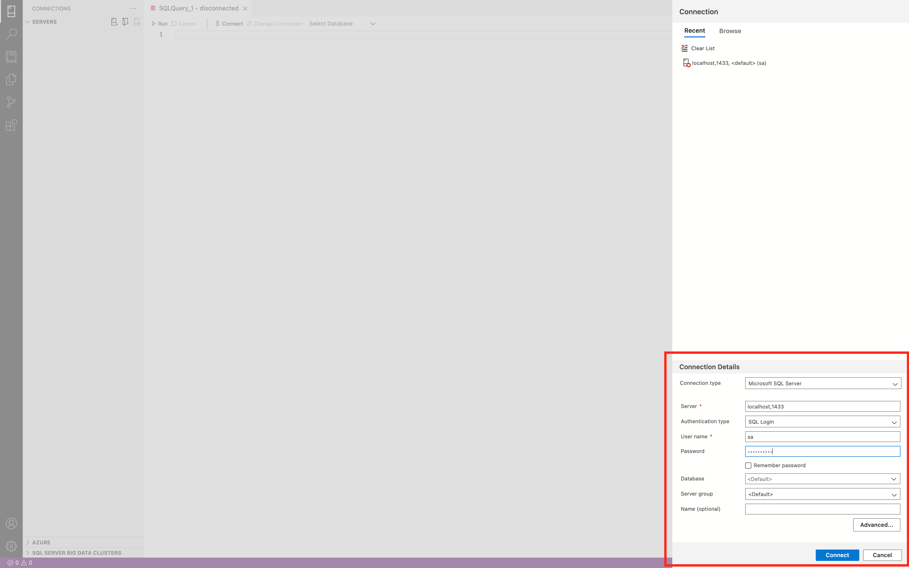
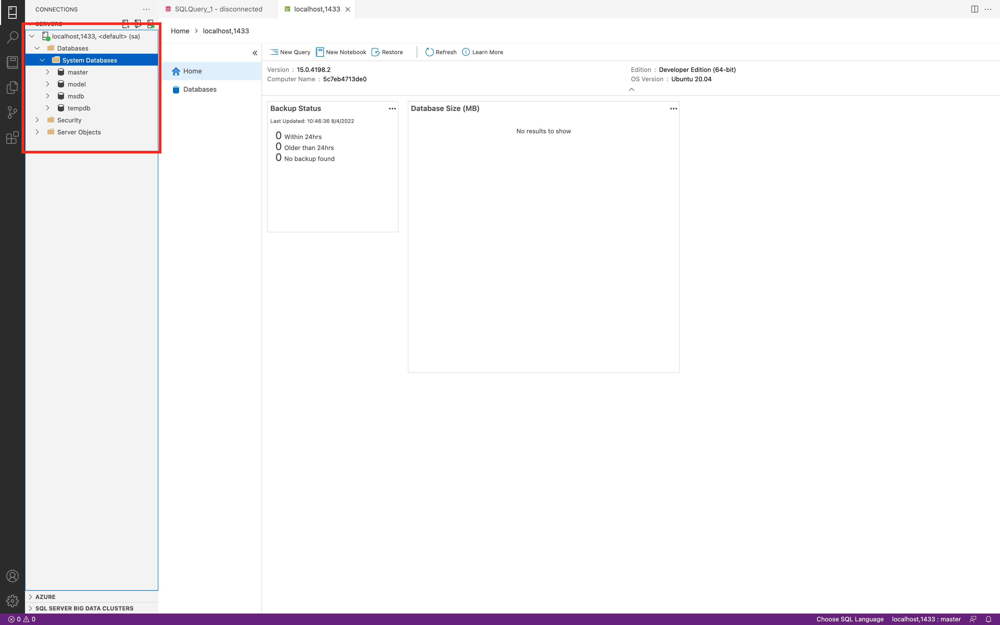

author: Douglas Hernández
summary: Resumen del módulo de herramientas digitales
id: dpdup-summary
tags: summary
categories: Educación, Herramientas Digitales
environments: Web
status: Published
feedback link: https://github.com/DouglasHdezT/misc-codelabs/issues

# Resumen del módulo de herramientas digitales

## Introducción
Duration: 0:05:00

Soy Douglas Hernández, ingeniero informático y docente de profesión. Pertenezco a la planta de docentes del Departamento de Electrónica e Informática, de la Universidad Centroamericana José Simeón Cañas.

Durante el ciclo 01 del año 2022, se realizaron diversas actividades en el marco de la aplicación de Herramientas Digitales en los distintos cursos. Particularmente, para este resumen, se hablará del desarrollo de dichas herramientas en las materias de Bases de Datos y Programación N-Capas. 

```java
System.out.println("------------- Summary -------------");
System.out.println("1. Planificación: Actividad Sincrónica");
System.out.println("2. Planificación: Actividad Asíncrona");
System.out.println("3. Planificación: Actividad Auto evaluada");
System.out.println("4. Reflexión final");
System.out.println("-----------------------------------");
```

## Planificación: Actividad Sincrónica
Duration: 0:05:00

### Contexto

Esta actividad se realizó de forma iterativa durante todo el ciclo en la materia de Bases de Datos. En general, la aplicación de herramientas digitales orientadas a temas expositivos es complicado en materias mas prácticas, como esta. Para mitigar esta dificultad, se realizo el montaje y prueba de un servidor de bases de datos (local), que permita experimentar a los estudiantes un entorno de producción, y su manipulación desde el ambiente virtual.

La herramienta digital que se presenta es: **Azure Data Studio**, un cliente de bases de datos, que con extensiones específicas, transforma el IDE en un entorno de producción robusto, y combinado con Git y Github (como gestores de versiones) se amplia a una experiencia colaborativa.

### Planificación de una sesión

#### Contextualización

| **Contexto**             | **Descripción**                                                                                                                                                                                           |
| ------------------------ | --------------------------------------------------------------------------------------------------------------------------------------------------------------------------------------------------------- |
| Situación de aprendizaje | Introducción a SQL y SQL Server                                                                                                                                                                           |
| Objetivo                 | Que el estudiante aprenda a configurar el entorno de desarrollo para la administración de Bases de Datos en el Gestor SQL Server; y comience a utilizar estructuras y comandos referentes al lenguaje SQL |
| Aprendizaje duradero     | 1. Utilización de un cliente cualquiera para administrar un gestor de bases de datos de forma remota. 2. Conocer el uso de los comandos más utilizados en SQL, específicamente DML y DDL                  |
| Tiempo                   | 2 Horas                                                                                                                                                                                                   |

#### Momentos

| **Momento** | **Actividad**                                                                                                                                                                                                      | **Recurso**                                    |
| ----------- | ------------------------------------------------------------------------------------------------------------------------------------------------------------------------------------------------------------------ | ---------------------------------------------- |
| Inicio      | - Introducción a SQL <br/> - Presentación de Gestores de DB y clientes para su consumo <br/> - Configuración de SQL Server <br/> - Enlace con Azure Data Studio                                                    | VideoConferencia en Google Meet                |
| Desarrollo  | - Crear una Base de Datos <br/> - Administrar tablas y relaciones <br> - Poblar las tablas <br> - Administrar los datos                                                                                            | Azure Data Studio                              |
| Cierre      | - Encuesta: ¿Qué cliente SQL Server se utilizó? <br/> - Encuesta: ¿Se entendió DML? <br/> - Encuesta: ¿Se entendió DDL? <br/> - Si existen los recursos (un server) realizar una conexión remota a un gestor Cloud | Video conferencia con Encuestas en Google Meet |

### Imágenes de referencia





<aside class="positive">
  <p>
    Para la realización de todas las sesiones, se realizó una guía de instalación del ambiente virtual para utilizar el gestor Microsoft SQL Server, y Azure Data Studio como cliente que lo consume. Esta guía se puede consultar en el siguiente enlace: <a href="https://bases-de-datos-uca.github.io/Codelabs/pages/install-sql-mac/"> https://bases-de-datos-uca.github.io/Codelabs/pages/install-sql-mac/ </a>
  </p>
</aside>

### Códigos realizados

```sql
--****************************************************
-- Bases de datos: Introducción a SQL
-- Autor: Douglas Hernández
-- Correspondencia: dohernandez@uca.edu.sv
-- Version: 1.0
--****************************************************

-- 00.00 BORRANDO BASE ANTERIOR
-- 00.10 UTILIZANDO DB BDD_01_2022

USE BDD_01_2022;

-- 00.20 COMPROBAR DATOS DE HOTEL

SELECT * FROM HOTEL;

-- 00.30 BORRAR TABLA HOTEL

DROP TABLE HOTEL;

-- 01.00 CREANDO TABLA BASE
-- 01.10 CREANDO TABLA HOTEL

CREATE TABLE HOTEL(
    id INT 
		PRIMARY KEY
		CHECK(id > 5),
    nombre VARCHAR(50) NOT NULL,
    direccion VARCHAR(100) NULL 
		DEFAULT 'Dirección no disponible',
    telefono CHAR(12) 
		NOT NULL 
		UNIQUE
		CHECK(telefono LIKE '+503[2|6|7][0-9][0-9][0-9][0-9][0-9][0-9][0-9]')
);

-- 01.20 POBLANDO LA TABLA HOTELES

INSERT INTO HOTEL VALUES 
	(12, 'Florencia', 		'345 Vernon Pass', 			'+50365136382'),
	(13, 'Royal Decameron', '6 Derek Crossing', 		'+50328338739'),
	(06, 'Presidente', 		'1 New Castle Terrace', 	'+50326063675'),
	(07, 'La Guitarra', 	'441 Armistice Lane', 		'+50371434775'),
	(08, 'Pacífico Azul', 	'5497 Mesta Avenue', 		'+50322730000'),
	(10, 'Casa Verde', 		'51417 Fisk Parkway', 		'+50322562539');

INSERT INTO HOTEL(id, nombre, telefono) VALUES
	(11, 'Villa Serena', 	'+50322499649'),
	(14, 'Barceló', 		'+50324942902'),
	(15, 'Palo Verde', 		'+50324942900'),
	(16, 'Tropico Inn',   	'+50379831153');

-- 01.30 VERIFICANDO DATOS

SELECT * FROM HOTEL;

-- 01.40 CREANDO TABLA HABITACION

CREATE TABLE HABITACION(
	id INT PRIMARY KEY,
	numero INT NOT NULL
		CHECK(numero > 0),
	precio MONEY NOT NULL,
	id_hotel INT NOT NULL
);

-- 01.50 POBLANDO LA TABLA HABITACION

INSERT INTO HABITACION VALUES
	(01, 100, 50.25, 06),
	(02, 101, 25.50, 06),
	(03, 102, 75.00, 06),
	(04, 250, 24.99, 11),
	(05, 300, 60.15, 11),
	(06, 301, 44.99, 11),
	(07, 302, 44.99, 15),
	(08, 104, 29.99, 03),
	(09, 105, 50.25, 02),
	(10, 106, 99.99, 01);

-- 01.60 VERIFICANDO DATOS

SELECT * FROM HABITACION;

-- 01.70 ELIMINADO TABLA HABITACIÓN PARA MEJORAR COMPORTAMIENTO

DROP TABLE HABITACION;

-- 02.00 RESTRICCION FK

-- 02.10 CREACION DE RESTRICCION FK
-- 02.11 DESDE CREACION DE TABLA EN ATRIBUTO

CREATE TABLE HABITACION(
	id INT PRIMARY KEY,
	numero INT NOT NULL
		CHECK(numero > 0),
	precio MONEY NOT NULL,
	id_hotel INT NOT NULL 
		FOREIGN KEY REFERENCES HOTEL(id)
);

INSERT INTO HABITACION VALUES
	(01, 100, 50.25, 06),
	(02, 101, 25.50, 06),
	(03, 102, 75.00, 06),
	(04, 250, 24.99, 11),
	(05, 300, 60.15, 11),
	(06, 301, 44.99, 11),
	(07, 302, 44.99, 15),
	(08, 104, 29.99, 08),
	(09, 105, 50.25, 07),
	(10, 106, 99.99, 13);

SELECT * FROM HABITACION;

DROP TABLE HABITACION;

-- 02.12 DESDE CREACION DE TABLA COMO CONSTRAINT

CREATE TABLE HABITACION(
	id INT PRIMARY KEY,
	numero INT NOT NULL
		CHECK(numero > 0),
	precio MONEY NOT NULL,
	id_hotel INT NOT NULL,
	CONSTRAINT fk_habitacion_hotel
		FOREIGN KEY(id_hotel)
		REFERENCES HOTEL(id) 
);

SELECT * FROM HABITACION;

DROP TABLE HABITACION;

-- 02.13 DESDE LA INSTRUCCION ALTER TABLE

CREATE TABLE HABITACION(
	id INT PRIMARY KEY,
	numero INT NOT NULL
		CHECK(numero > 0),
	precio MONEY NOT NULL,
	id_hotel INT NOT NULL
);

ALTER TABLE HABITACION ADD CONSTRAINT fk_habitacion_hotel
	FOREIGN KEY(id_hotel) REFERENCES HOTEL(id);

SELECT * FROM HABITACION;

-- 02.20 BORRANDO TABLAS TRY: 1
-- 02.21 BORRANDO UN HOTEL SIN HABITACIONES

DELETE FROM HOTEL WHERE id = 16;

SELECT * FROM HOTEL;

-- 02.22 BORRANDO UN HOTEL CON HABITACIONES

DELETE FROM HOTEL WHERE id = 6; -- ESTO FALLA

DELETE FROM HABITACION WHERE id_hotel = 6;

DELETE FROM HOTEL WHERE id = 6; -- AQUI YA NO

-- REINICIAR LOS REGISTROS DE AMBAS TABLAS

DELETE FROM HABITACION;
DELETE FROM HOTEL;

-- 02.30 BORRANDO TABLAS TRY: 2
-- 02.31 BORRANDO LAS TABLAS

DROP TABLE HABITACION;
DROP TABLE HOTEL;

-- 03.20 APLICANDO LAS RESTRICCIONES

CREATE TABLE HOTEL(
    id INT 
		PRIMARY KEY
		CHECK(id > 5),
    nombre VARCHAR(50) NOT NULL,
    direccion VARCHAR(100) NULL 
		DEFAULT 'Dirección no disponible',
    telefono CHAR(12) 
		NOT NULL 
		UNIQUE
		CHECK(telefono LIKE '+503[2|6|7][0-9][0-9][0-9][0-9][0-9][0-9][0-9]')
);

CREATE TABLE HABITACION(
	id INT PRIMARY KEY,
	numero INT NOT NULL
		CHECK(numero > 0),
	precio MONEY NOT NULL,
	id_hotel INT NOT NULL
);

ALTER TABLE HABITACION ADD CONSTRAINT fk_habitacion_hotel
	FOREIGN KEY(id_hotel)
	REFERENCES HOTEL(id)
	ON DELETE CASCADE
	ON UPDATE CASCADE;

-- 03.30 POBLANDO AMBAS TABLAS

INSERT INTO HOTEL VALUES 
	(12, 'Florencia', 		'345 Vernon Pass', 			'+50365136382'),
	(13, 'Royal Decameron', '6 Derek Crossing', 		'+50328338739'),
	(06, 'Presidente', 		'1 New Castle Terrace', 	'+50326063675'),
	(07, 'La Guitarra', 	'441 Armistice Lane', 		'+50371434775'),
	(08, 'Pacífico Azul', 	'5497 Mesta Avenue', 		'+50322730000'),
	(10, 'Casa Verde', 		'51417 Fisk Parkway', 		'+50322562539');

INSERT INTO HOTEL(id, nombre, telefono) VALUES
	(11, 'Villa Serena', 	'+50322499649'),
	(14, 'Barceló', 		'+50324942902'),
	(15, 'Palo Verde', 		'+50324942900'),
	(16, 'Tropico Inn',   	'+50379831153');

INSERT INTO HABITACION VALUES
	(01, 100, 50.25, 06),
	(02, 101, 25.50, 06),
	(03, 102, 75.00, 06),
	(04, 250, 24.99, 11),
	(05, 300, 60.15, 11),
	(06, 301, 44.99, 11),
	(07, 302, 44.99, 15),
	(08, 104, 29.99, 08),
	(09, 105, 50.25, 07),
	(10, 106, 99.99, 13);

SELECT * FROM HOTEL;
SELECT * FROM HABITACION;

-- 03.40 BORRANDO UN VALOR EN HOTEL CON HABITACIONES ASIGNADAS

DELETE FROM HOTEL WHERE id = 11;

-- 03.50 CONSULTANDO LOS DATOS

SELECT * FROM HOTEL;
SELECT * FROM HABITACION;

-- 03.60 BORRANDO LAS TABLAS PARA HACER UN REBOOT

DROP TABLE HABITACION;
DROP TABLE HOTEL;

-- 04.00 IMPLEMENTANDO LAS TABLAS DE GESTIÓN DE HOTELES

-- 04.10 CREANDO LAS TABLAS Y RESTRICCIONES FK
-- 04.11 TABLA HOTEL

CREATE TABLE HOTEL(
    id INT 
		PRIMARY KEY
		CHECK(id > 1),
    nombre VARCHAR(50) NOT NULL,
    direccion VARCHAR(100) NULL 
		DEFAULT 'Dirección no disponible',
    telefono CHAR(12) 
		NOT NULL 
		UNIQUE
		CHECK(telefono LIKE '+503[2|6|7][0-9][0-9][0-9][0-9][0-9][0-9][0-9]'),
	id_hotel_gestor 
		INT NULL
		DEFAULT 1
);

ALTER TABLE HOTEL ADD CONSTRAINT fk_hotel_gestor
	FOREIGN KEY(ID_HOTEL_GESTOR)
	REFERENCES HOTEL(id)
	ON DELETE SET DEFAULT
	ON UPDATE SET DEFAULT;

ALTER TABLE HOTEL DROP CONSTRAINT  fk_hotel_gestor;

-- 04.12 TABLA HABITACION

CREATE TABLE HABITACION(
	id INT PRIMARY KEY,
	numero INT NOT NULL,
	precio MONEY NOT NULL,
	id_hotel INT NOT NULL
);

-- 04.14 TABLA CLIENTE

CREATE TABLE CLIENTE(
	id INT PRIMARY KEY,
	nombre VARCHAR(50) NOT NULL,
	documento CHAR(10)
		CHECK(documento LIKE '[0-9][0-9][0-9][0-9][0-9][0-9][0-9][0-9]-[0-9]')
);

-- 04.13 TABLA RESERVA

CREATE TABLE RESERVA(
	id INT PRIMARY KEY,
	checkin DATE NOT NULL,
	checkout DATE NOT NULL,
	id_cliente INT NOT NULL,
	id_habitacion INT NOT NULL
);

-- 04.15 TABLA COMENTARIO

CREATE TABLE COMENTARIO(
	id INT PRIMARY KEY,
	comentario VARCHAR(140) NOT NULL,
	calificacion INT
		CHECK(calificacion > 0 AND calificacion <= 10),
	id_cliente INT NOT NULL,
	id_hotel INT NOT NULL
);

-- 04.16 TABLA SERVICIO

CREATE TABLE SERVICIO(
	id INT PRIMARY KEY,
	nombre VARCHAR(50) NOT NULL,
	precio MONEY NOT NULL,
	descript VARCHAR(140) NOT NULL
);

-- 04.17 TABLA TICKETSERVCIO

CREATE TABLE TICKET_SERVICIO (
	id_reserva INT NOT NULL,
	id_servicio INT NOT NULL
);

ALTER TABLE TICKET_SERVICIO ADD CONSTRAINT pk_ticket_servicio
	PRIMARY KEY(id_reserva, id_servicio); 
ALTER TABLE TICKET_SERVICIO ADD CONSTRAINT fk_ticket_servicio_reserva
	FOREIGN KEY (id_reserva) REFERENCES RESERVA(id)
	ON DELETE NO ACTION
	ON UPDATE CASCADE
ALTER TABLE TICKET_SERVICIO ADD CONSTRAINT fk_ticket_servicio_servicio
	FOREIGN KEY (id_servicio) REFERENCES SERVICIO(id)
	ON DELETE NO ACTION
	ON UPDATE CASCADE
```

<aside class="positive">
  <p>
    El resto de códigos realizados a lo largo de la materia se pueden encontrar en el siguiente enlace: <a href="https://github.com/DouglasHdezT/BDD_scripts_01_22"> https://github.com/DouglasHdezT/BDD_scripts_01_22 </a>
  </p>
</aside>

## Planificación: Actividad Asíncrona
Duration: 0:05:00

### Contexto

Los codelabs son herramientas guiadas que permiten el aprendizaje progresivo de temáticas u tecnologías. Desarrollados por Google, la tecnología Claat permite, a partir de archivos markdown, generar codelabs de cualquier temática.

Esto permite dinamizar actividades y complementar los conceptos abordados en una clase. Además, refuerza áreas en el estudiante a partir de la técnica "Aprender haciendo".

Esta actividad consistirá en implementar un web server con autenticación basada en la librería Spring Security. Para ello se guiarán de un codelab, donde se detallan los pasos y conceptos que giran al rededor del tema. 

Al final, los estudiantes compartieron sus resultados en la plataforma de github Classroom. Ambiente educativo, donde se centralizan las entregas de este taller.

### Planificación

| **Contexto**        | **Descripción**                                                                                                                                   |
| ------------------- | ------------------------------------------------------------------------------------------------------------------------------------------------- |
| Fecha               | 22/23 mayo de 2022, desde las 18:00 del 22 hasta las 12:00 del 23                                                                                 |
| Objetivo            | Construir un servidor web con arquitectura REST que implemente un sistema de autenticación                                                        |
| Tipo de trabajo     | Grupal, Asíncrono                                                                                                                                 |
| Producto esperado   | - Servidor Web en Spring Boot, que implemente un sistema de autenticación basado en Spring Boot y JWT <br/> - Rutas públicas y privadas de prueba |
| Tiempo de ejecución | 2 Horas clase (100 min)                                                                                                                           |

<aside class="primary">
  <p>
    La definición del Codelab, junto a las indicaciones y el desarrollo como tal, se encuentran en el  siguiente enlace: <a href="https://douglashdezt.github.io/misc-codelabs/pages/pnc-tallerIII/"> https://douglashdezt.github.io/misc-codelabs/pages/pnc-tallerIII/ </a>
  </p>
</aside>


## Planificación: Actividad Auto-evaluada
Duration: 0:05:00

### Contexto

Github classroom, además de permitir subir y administrar repositorios de código para alumnos, brinda muchas herramientas para los docentes, entre ellos se desatacan 2: 

- Conexión con Moodle, permitiendo acceder al listado de estudiantes automáticamente, colocar notas, crear actividades, etc
- Calificación automática de código, basada en pruebas de funciones individuales dentro del código, y haciendo uso de github actions. La herramienta crea un ambiente específico para que una app, webserver, o función se ejecute con parámetros específicos y condiciones establecidas. Actualmente el módulo de calificación permite hacer pruebas a multiples lenguajes e infraestructuras, volviéndose versátil y muy útil.

Esta actividad consiste en, a partir de un codelab y un código base, generar una solución de software que sea automáticamente evaluada por github classroom, y actualice la nota en el moodle de la materia.

### Planificación

| **Contexto**        | **Descripción**                                                                                                                                   |
| ------------------- | ------------------------------------------------------------------------------------------------------------------------------------------------- |
| Fecha               | 22/23 mayo de 2022, desde las 18:00 del 22 hasta las 12:00 del 23                                                                                 |
| Objetivo            | Construir un servidor web con arquitectura REST que implemente un sistema de autenticación                                                        |
| Tipo de trabajo     | Grupal, Asíncrono                                                                                                                                 |
| Producto esperado   | - Servidor Web en Spring Boot, que implemente un sistema de autenticación basado en Spring Boot y JWT <br/> - Rutas públicas y privadas de prueba |
| Tiempo de ejecución | 2 Horas clase (100 min)                                                                                                                           |


## Reflexión final
Duration: 0:05:00